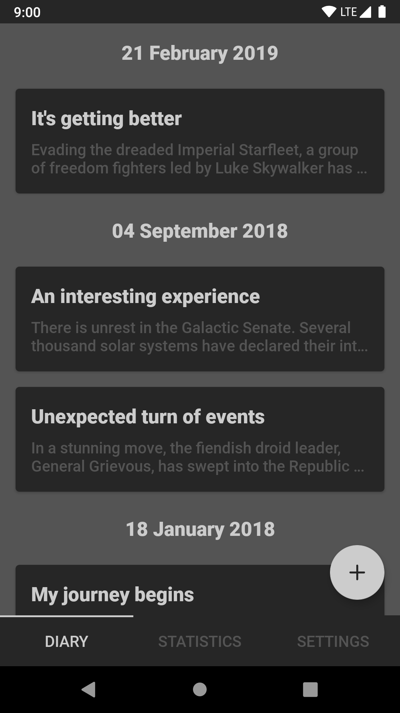
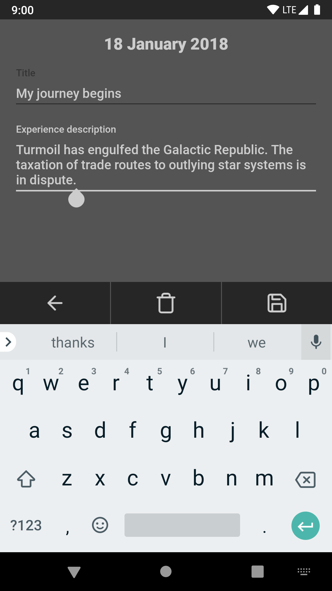
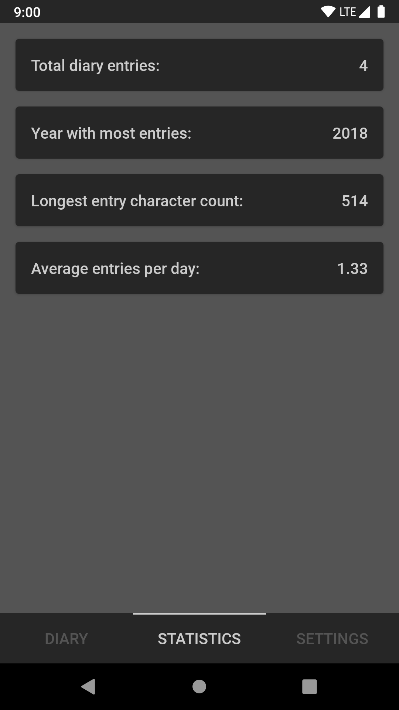
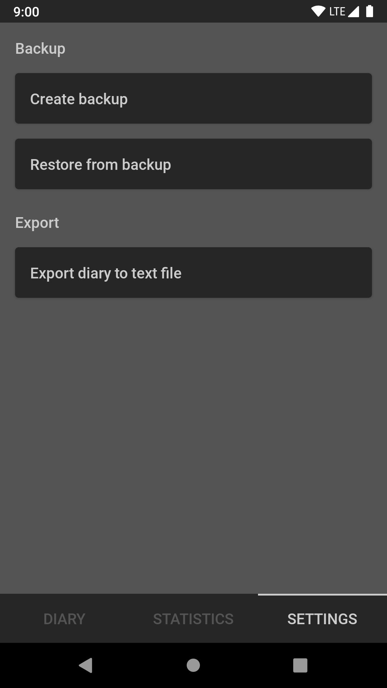

### My Astral Diary

&nbsp;

&nbsp;

&nbsp;

##### Before building:

1. Copy "signing/signing.gradle.example" as "signing/signing.gradle"
2. (Only for release builds) Create a keystore in the "signing" directory and set correct values in the "signing/signing.gradle" file.

##### Building release builds:

1. Execute command "gradlew assembleRelease" (Windows) / "gradle assembleRelease" (Other)
2. The .apk file should appear in "project/build/outputs/apk/release" directory.

##### After releasing to store:

1. Upload the "project/build/outputs/mappings/release/mapping.txt" file to store console. This will de-obfuscate crash reporting.