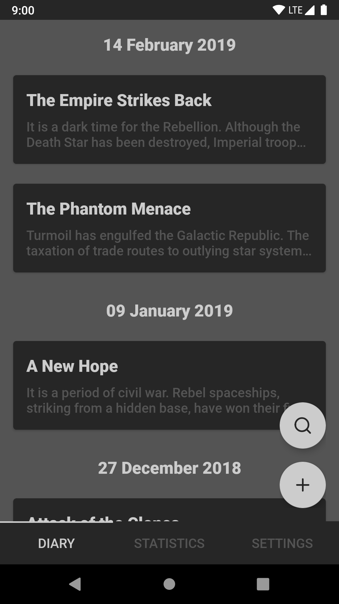

### My Astral Diary
&nbsp;&nbsp;&nbsp;

A diary application with backup and export options. It features grouping entries by date, statistics which give you insight into your progress and a dark interface that goes easy on your eyes.
No network connection or suspicious permissions are required!

[Download now on Google Play Store](https://play.google.com/store/apps/details?id=com.sengami.myastraldiary)
##### Prerequisites:

1. You need to have JDK installed and the JAVA_HOME system variable set.

##### (Optional) For release builds:

1. Create a "signing" folder in projects root directory.
2. Create a keystore file and text files with alias and passwords according to the "gradle.properties" file's "Signing" section.

##### Building release builds:

1. Execute command "gradlew assembleRelease" (Windows) / "gradle assembleRelease" (Other)
2. The .apk file should appear in "project/build/outputs/apk/release" directory.

##### After releasing to store:

1. Upload the "project/build/outputs/mappings/release/mapping.txt" file to store console. This will de-obfuscate crash reports.

##### About architecture:

This project applies Domain Driven Development principles, separating project into the main Domain layer and gui/data layers which depend on it. To improve scalability it has been also separated into modules by feature, and common utilities have been moved to their own modules as well.

